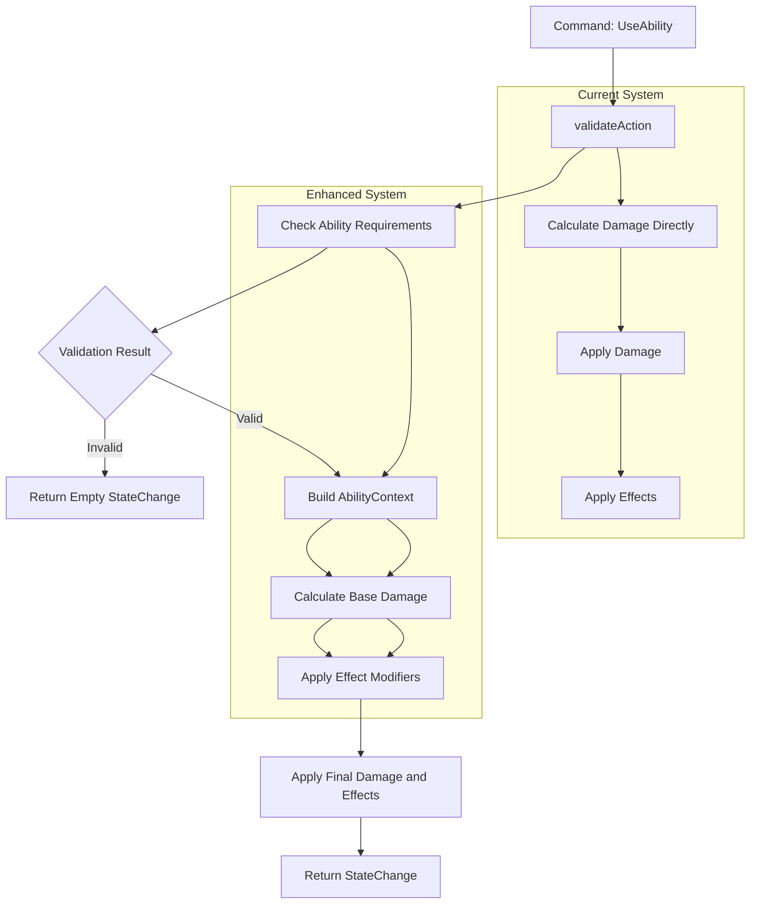

# Enhanced Effects Framework Implementation Plan

## Overview

This document tracks the design and implementation of an enhanced effects framework that supports dynamic, formula-based effects with complex interactions. This system extends beyond basic stat modifiers to enable sophisticated gameplay mechanics.

## Target Effect Categories

### 1. Damage Amplification with Resource Cost

**Type**: HP-cost damage boost

- When active, invoking abilities consumes % of ability's base damage from user's HP
- Increases ability's final damage proportionally

### 2. Resource Conversion

**Type**: HP/MP transformation

- Converts between resource types using formulas
- Instant effect with calculated exchange rates

### 4. Distance-Based Damage

**Type**: Positional damage calculation

- AoE/MultiHit with distance-modified damage
- Damage calculation includes spatial factors

## AbilityContext Flow

### Current vs Enhanced Resolution Flow



### Context Pipeline Pattern


### AbilityContext Construction Point

The context is built in `resolveAbility` after validation succeeds:

```fsharp
// Current location in resolveAbility after validation
| ValueSome struct (actorComponents, struct (targetId, targetComponents), costOpt, abilityDef) ->
    let! actorStats = rparams.derivedStats |> AMap.find actorId
    let! targetStats = rparams.derivedStats |> AMap.find targetId
    let! gameTime = rparams.gameTime

    // NEW: Build AbilityContext here
    let abilityContext = {
        InvokerStats = actorStats
        TargetStats = targetStats
        AbilityResult = ValueNone  // Will be populated after damage calc
        InvokerEffects = actorComponents.Effects
        TargetEffects = targetComponents.Effects
        GameTime = gameTime
    }

    // Process OnAbilityInvoke effects with context
    // Calculate damage with effect modifiers
    // Update context with damage result
    // Continue with enhanced pipeline...
```

## Implementation Steps

### Step 0.5: Passive Skills & Ability Requirements System ✅ (Implemented)

Redesign ability system with separate passive/active definitions:

```fsharp
[<Struct>]
type PassiveAbilityDefinition = {
  Id: int<AbilityId>
  Name: string
  Effects: IndexList<int<EffectId>>  // Auto-applied permanent effects
  Requirements: IndexList<AbilityRequirement>
}

[<Struct>]
type ActiveAbilityDefinition = {
  Id: int<AbilityId>
  Name: string
  Cooldown: int64<Tick>
  Cost: ResourceCost voption
  Targeting: TargetType
  FormulaId: int<FormulaId> voption
  Effects: IndexList<int<EffectId>>
  Requirements: IndexList<AbilityRequirement>
}

[<Struct>]
type AbilityKind =
  | Passive of PassiveAbilityDefinition
  | Active of ActiveAbilityDefinition

[<Struct>]
type AbilityRequirement =
  | StatRequirement of Stat * int
  | AbilityRequirement of int<AbilityId>
  | FormulaRequirement of int<FormulaId>

[<Struct>]
type Duration =
  | Instant | Timed of int64<Tick> | Loop of int64<Tick> * int64<Tick>
  | Permanent  // NEW: For passive skill effects
```

**Integration with Enhanced Effects:**

- **Passive abilities**: Create `Permanent` duration effects when learned
- **Active abilities**: Use the existing resolution pipeline (no hook infrastructure)
- **Requirements**: Validated during standard ability validation
- **Permanent effects**: Skip tick processing, never expire

**Example - Gun Carrier System:**

```fsharp
// Passive ability definition
Passive {
  Id = 50<AbilityId>
  Name = "Gun Carrier"
  Effects = IndexList.ofList [51<EffectId>] // Creates permanent effect
  Requirements = IndexList.empty
}

// Gun ability with requirement
Active {
  Id = 100<AbilityId>
  Name = "Pistol Shot"
  Requirements = IndexList.ofList [
    AbilityRequirement(50<AbilityId>) // Must have Gun Carrier
  ]
  // ... other active ability fields
}

// Permanent effect for Gun Carrier
{
  Id = 51<EffectId>
  Name = "Gun Proficiency"
  Duration = Permanent  // Never expires
  Kind = EffectKind.Buff
  // ... other fields
}
```

### Step 1: Resolution Simplification ✅

Adopt a straightforward, linear resolution approach (pre/compute/apply) without introducing a hook infrastructure.

### Step 2: Dynamic Effect Modifiers ✅ (Implemented in Domain.fs, partial support in Resolution.fs)

Replace static modifiers with formula-based system:

```fsharp
[<Struct>]
type EffectModifier =
  | StaticMod of StatModifier           // Current system (backward compatibility)
  | DynamicMod of int<FormulaId>        // Formula-based calculation
  | AbilityDamageMod of float           // % modifier to ability damage
  | ResourceConversion of ResourceType * ResourceType * float
```

### Step 3: Ability Resolution Context ✅ (AbilityContext type and context pipeline present)

Create context for effects to access during resolution:

```fsharp
[<Struct>]
type AbilityContext = {
  InvokerStats: DerivedStats
  TargetStats: DerivedStats
  AbilityResult: DamageResult voption
  InvokerEffects: ActiveEffect alist
  TargetEffects: ActiveEffect alist
  GameTime: int64<Tick>
}
```


### Step 5: Linear Effect Processing Pipeline ⏳

Modify resolution to process effects in a simple, linear flow:

1. Pre-Resolution:

   - Apply resource costs (including HP-cost amplification rules)
   - Gather relevant modifiers and context

2. Ability Execution:

   - Calculate base values
   - Apply dynamic modifiers and formulas

3. Apply Results:

   - Apply damage/heal and state updates
   - Apply resource conversion mechanics

### Step 6: Effect Definition Extensions ✅ (EffectDefinition extended in Domain.fs)

Extend `EffectDefinition` to support new capabilities:

```fsharp
[<Struct>]
type EffectDefinition = {
  Id: int<EffectId>
  Name: string
  Kind: EffectKind
  Stacking: StackingRule
  Duration: Duration
  Modifiers: IndexList<EffectModifier>
  FormulaId: int<FormulaId> voption     // NEW: Dynamic calculations
}
```

## Implementation Priority

### Phase 4.5: Enhanced Effects Framework (Before Phase 5)

**Status**: 🎯 **REQUIRED BEFORE PHASE 5**

1. **Step 0.5**: Passive skills and ability requirements
2. **Step 1-2**: Dynamic modifiers and formula integration
3. **Step 3**: Ability context system
5. **Step 5**: Linear processing pipeline
6. **Step 6**: Effect definition extensions

### Example Implementations

#### HP-Cost Damage Boost Effect

```fsharp
{
  Id = 200<EffectId>
  Name = "Sacrificial Power"
  Kind = EffectKind.Buff
  Duration = Timed(30000L<Tick>)
  Stacking = StackingRule.RefreshDuration
  Modifiers = IndexList.ofList [
    AbilityDamageMod(0.10)  // 10% damage increase
  ]
  FormulaId = ValueSome 100<FormulaId>  // HP cost calculation
}
```

## Integration Points

### Resolution.fs Changes

- Add `AbilityKind` pattern matching in `validateAction`
- Add ability requirement validation (only for `Active` abilities)
- Skip tick processing for `Permanent` duration effects
- Extend `resolveAbility` with a clear pre/compute/apply flow
- Implement HP-cost amplification, dynamic modifiers, and resource conversion within this flow

### Effects.fs Changes

- Provide helpers/utilities for linear effect processing
- Add dynamic modifier calculations

### Domain.fs Changes

- Replace `AbilityDefinition` with `AbilityKind` discriminated union
- Add `PassiveAbilityDefinition` and `ActiveAbilityDefinition`
- Add `AbilityRequirement` types
- Add `Permanent` to `Duration` type
- Extend effect and resource types
- Update ability context typese ability context types

## Testing Strategy

### Unit Tests

- Passive skill effect creation
- Ability requirement validation
- Resource conversion accuracy
- Dynamic modifier calculations

### Integration Tests

- Gun Carrier passive skill system
- Ability requirement blocking/allowing
- HP-cost damage amplification mechanics
- Magic barrier absorption + regeneration
- Resource conversion mechanics
- Complex effect interactions

### Property Tests

- Resource conversions maintain balance
- Effect stacking with dynamic modifiers

## Success Criteria

1. ✅ All 4 effect categories implemented and tested
2. ✅ Backward compatibility with existing effects maintained
3. ✅ Performance impact minimal (adaptive collections)
4. ✅ Formula-based effects work with existing formula system

## Dependencies

- **Requires**: Current Phase 0-4 completion
- **Blocks**: Phase 5 (Save/Load) - enhanced effects must be serializable
- **Enables**: Advanced gameplay mechanics and content creation

---

**Next Action**: Begin Step 1 implementation after Phase 4 completion confirmation.
