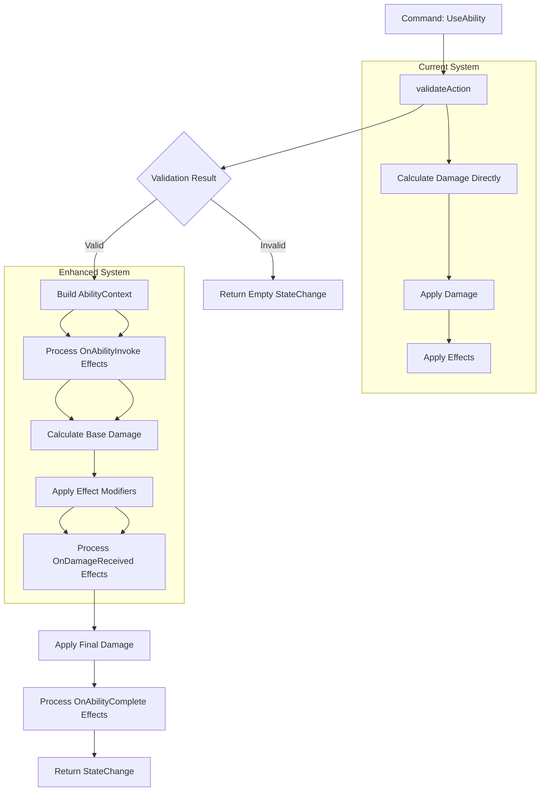

# Enhanced Effects Framework Implementation Plan

## Overview

This document tracks the design and implementation of an enhanced effects framework that supports dynamic, formula-based effects with complex interactions. This system extends beyond basic stat modifiers to enable sophisticated gameplay mechanics.

## Target Effect Categories

### 1. Damage Amplification with Resource Cost
**Type**: HP-cost damage boost
- When active, invoking abilities consumes % of ability's base damage from user's HP
- Increases ability's final damage proportionally
- **Hook**: OnAbilityInvoke (pre-execution)

### 2. Damage Absorption with Regeneration
**Type**: Shield/barrier mechanics
- Creates temporary HP pool based on caster stats
- Incoming damage hits barrier before actual HP
- Barrier regenerates when not receiving damage
- **Hook**: OnDamageReceived (damage interception)

### 3. Resource Conversion
**Type**: HP/MP transformation
- Converts between resource types using formulas
- Instant effect with calculated exchange rates
- **Hook**: Instant (direct resource manipulation)

### 4. Distance-Based Damage
**Type**: Positional damage calculation
- AoE/MultiHit with distance-modified damage
- Damage calculation includes spatial factors
- **Hook**: OnAbilityInvoke + custom targeting (future)

## AbilityContext Flow

### Current vs Enhanced Resolution Flow



### Context Pipeline Pattern


### AbilityContext Construction Point

The context is built in `resolveAbility` after validation succeeds:

```fsharp
// Current location in resolveAbility after validation
| ValueSome struct (actorComponents, struct (targetId, targetComponents), costOpt, abilityDef) ->
    let! actorStats = rparams.derivedStats |> AMap.find actorId
    let! targetStats = rparams.derivedStats |> AMap.find targetId
    let! gameTime = rparams.gameTime
    
    // NEW: Build AbilityContext here
    let abilityContext = {
        InvokerStats = actorStats
        TargetStats = targetStats
        AbilityResult = ValueNone  // Will be populated after damage calc
        InvokerEffects = actorComponents.Effects
        TargetEffects = targetComponents.Effects
        GameTime = gameTime
    }
    
    // Process OnAbilityInvoke effects with context
    // Calculate damage with effect modifiers
    // Update context with damage result
    // Continue with enhanced pipeline...
```

## Implementation Steps

### Step 1: Effect Hook System
Add effect hooks to intercept different resolution phases:

```fsharp
[<Struct>]
type EffectHook =
  | OnAbilityInvoke     // Before ability executes
  | OnDamageReceived    // When taking damage
  | OnResourceChange    // When HP/MP changes
  | OnAbilityComplete   // After ability resolves
  | OnTick              // Periodic processing (existing DoT/HoT)
```

### Step 2: Dynamic Effect Modifiers
Replace static modifiers with formula-based system:

```fsharp
[<Struct>]
type EffectModifier =
  | StaticMod of StatModifier           // Current system (backward compatibility)
  | DynamicMod of int<FormulaId>        // Formula-based calculation
  | AbilityDamageMod of float           // % modifier to ability damage
  | ResourceConversion of ResourceType * ResourceType * float
  | ShieldGeneration of int<FormulaId>  // Shield HP calculation
```

### Step 3: Ability Resolution Context
Create context for effects to access during resolution:

```fsharp
[<Struct>]
type AbilityContext = {
  InvokerStats: DerivedStats
  TargetStats: DerivedStats
  AbilityResult: DamageResult voption
  InvokerEffects: ActiveEffect alist
  TargetEffects: ActiveEffect alist
  GameTime: int64<Tick>
}
```

### Step 4: Shield/Barrier System
Extend resources to support temporary HP pools:

```fsharp
[<Struct>]
type Resources = {
  HP: int
  MP: int
  Shields: HashMap<int<EffectId>, ShieldData>
  Status: Status
}

[<Struct>]
type ShieldData = {
  CurrentHP: int
  MaxHP: int
  LastHitTime: int64<Tick>
  RegenDelay: int64<Tick>
  RegenRate: int // HP per tick
}
```

### Step 5: Enhanced Effect Processing Pipeline
Modify resolution to process effects at different hooks:

1. **Pre-Ability Processing**:
   - Process `OnAbilityInvoke` effects
   - Apply HP costs for damage amplification
   - Calculate damage bonuses

2. **Ability Execution**:
   - Apply base damage with effect modifiers
   - Process formula-based enhancements

3. **Damage Reception**:
   - Process `OnDamageReceived` effects
   - Apply shield absorption mechanics
   - Handle damage reflection

4. **Post-Ability Processing**:
   - Process `OnAbilityComplete` effects
   - Apply resource conversion mechanics

### Step 6: Effect Definition Extensions
Extend `EffectDefinition` to support new capabilities:

```fsharp
[<Struct>]
type EffectDefinition = {
  Id: int<EffectId>
  Name: string
  Kind: EffectKind
  Stacking: StackingRule
  Duration: Duration
  Modifiers: IndexList<EffectModifier>
  Hooks: IndexList<EffectHook>          // NEW: When effect activates
  FormulaId: int<FormulaId> voption     // NEW: Dynamic calculations
}
```

## Implementation Priority

### Phase 4.5: Enhanced Effects Framework (Before Phase 5)
**Status**: 🎯 **REQUIRED BEFORE PHASE 5**

1. **Step 1-2**: Core effect hooks and dynamic modifiers
2. **Step 3**: Ability context system
3. **Step 4**: Shield/barrier mechanics
4. **Step 5**: Enhanced processing pipeline
5. **Step 6**: Effect definition extensions

### Example Implementations

#### HP-Cost Damage Boost Effect
```fsharp
{
  Id = 200<EffectId>
  Name = "Sacrificial Power"
  Kind = EffectKind.Buff
  Duration = Timed(30000L<Tick>)
  Stacking = StackingRule.RefreshDuration
  Modifiers = IndexList.ofList [
    AbilityDamageMod(0.10)  // 10% damage increase
  ]
  Hooks = IndexList.ofList [OnAbilityInvoke]
  FormulaId = ValueSome 100<FormulaId>  // HP cost calculation
}
```

#### Magic Barrier Effect
```fsharp
{
  Id = 201<EffectId>
  Name = "Arcane Barrier"
  Kind = EffectKind.Buff
  Duration = Timed(60000L<Tick>)
  Stacking = StackingRule.RefreshDuration
  Modifiers = IndexList.ofList [
    ShieldGeneration(101<FormulaId>)  // Shield HP = MA * 3
  ]
  Hooks = IndexList.ofList [OnDamageReceived]
  FormulaId = ValueSome 101<FormulaId>
}
```

## Integration Points

### Resolution.fs Changes
- Extend `resolveAbility` to process effect hooks
- Add shield damage interception logic
- Implement pre/post ability effect processing

### Effects.fs Changes
- Add hook-based effect processing
- Implement shield system management
- Add dynamic modifier calculations

### Domain.fs Changes
- Extend effect and resource types
- Add shield data structures
- Update ability context types

## Testing Strategy

### Unit Tests
- Effect hook processing
- Shield absorption mechanics
- Resource conversion accuracy
- Dynamic modifier calculations

### Integration Tests
- HP-cost damage amplification mechanics
- Magic barrier absorption + regeneration
- Resource conversion mechanics
- Complex effect interactions

### Property Tests
- Shield HP never exceeds max
- Resource conversions maintain balance
- Effect stacking with dynamic modifiers

## Success Criteria

1. ✅ All 4 effect categories implemented and tested
2. ✅ Backward compatibility with existing effects maintained
3. ✅ Performance impact minimal (adaptive collections)
4. ✅ Formula-based effects work with existing formula system
5. ✅ Shield system integrates with damage resolution
6. ✅ Effect hooks process at correct resolution phases

## Dependencies

- **Requires**: Current Phase 0-4 completion
- **Blocks**: Phase 5 (Save/Load) - enhanced effects must be serializable
- **Enables**: Advanced gameplay mechanics and content creation

---

**Next Action**: Begin Step 1 implementation after Phase 4 completion confirmation.